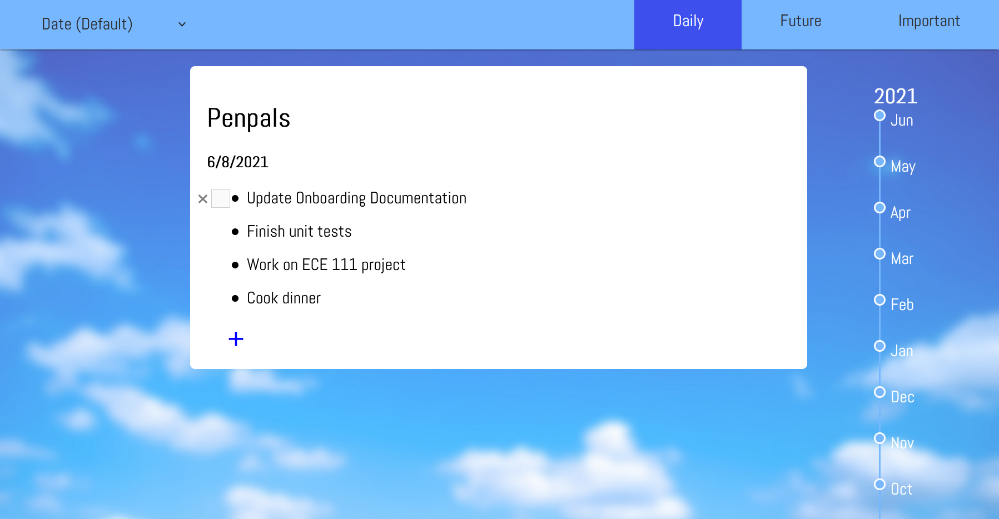

# Team 5 - PenPals

## PenPals Web App
Use the live app [here](https://cse110-sp21-group5.github.io/cse110-sp21-group5/source/).

## How to use the app
- Clicking on the **+** button will open up a textbox to add your entry
  - Entries will be added to the current date if the daily log is the currently selected tab
  - For the future log, select a date to add an entry for that month (dates for the next 5 months or so can be selected)
    - Note that nothing will happen if the user tries to add an entry without a selected date 
- Clicking on an existing entry will open up a textbox which will allow the user to edit their entry
- Hovering over an entry will display a button and a checkbox:
   - The **x** button is used to delete an entry
   - The checkbox is used to mark an entry as important
     - Marking an entry as important will also display the entry in the important log
     - Note that deleting an entry from the important log will simply unflag the entry
 - To filter entries by a custom tag first add **#tag** or **#tag1,tag2,...**, where tag is the custom tag, at the end of the entry
    - On the top right corner choose the tag to filter by
 - To scroll to an entry using the sidebar:
    - For the daily log, click on the desired month and then click on the desired day 
    - For the future log, click on the desired month

## Developer Team
Check out our team page and learn about who we are [here](admin/team.md).

## Documentation
See our code's documentation [here](https://cse110-sp21-group5.github.io/cse110-sp21-group5/docs/global.html).

## Recommended Steps to Contribute
- We suggest using VS Code and following these steps:
  - `git clone https://github.com/cse110-sp21-group5/cse110-sp21-group5.git`
  - Get StandadrdJS Plugin and setup for semistandardjs so your future additions follow our style guidelines
  - When you are ready to add a feature, create a branch named according to the feature and add it there
  - Write unit tests to the testing file
  - Upon merging, review code with at least two other team members as you merge
  - Check that all tests pass and code quality standards are met using the automated tesing and quality checking tools

## Meetings
- We followed Agile methodology during the development of this project. You can find our meeting notes and sprint documentation [here](admin/meetings).
