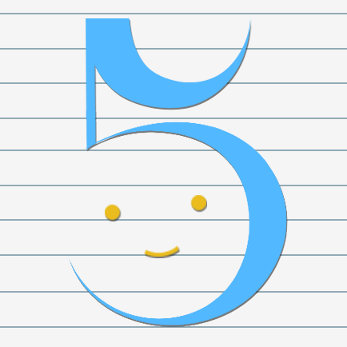
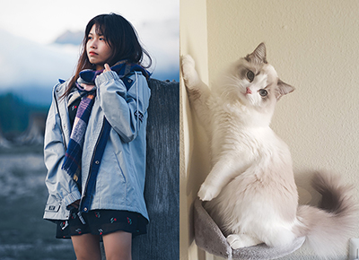
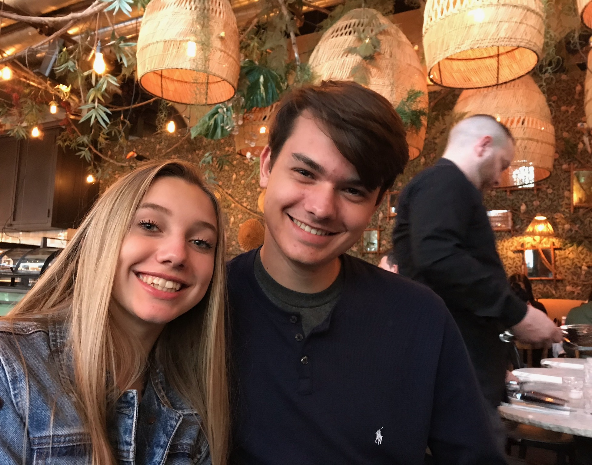
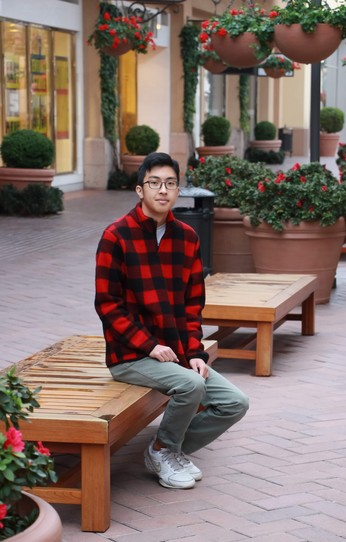
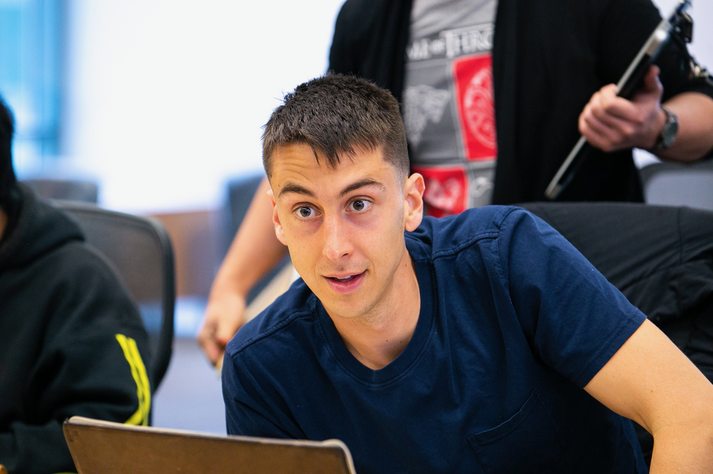

# Penpals Team Page

Team Values
-----------------
- Collaboration: We believe in strong collaboration between all members.
- Dependability: We believe in depending on one another for all of our work.
- Respectfulness: We believe in treating everyone with respect in the group.
- Learning: We believe everyone should learn in the project, and should be open to asking questions.
- Cleanliness: We believe everyone should be clean in their code and documentation.
- Having fun: We want all members to have fun with the work!

Roster
-----------------
My name is **Nico Tahernia, I'm a third-year Mathematics-Computer Science major. I'm one of the team leaders and also a full-stack engineer
and architect for the project.** My previous work experience involves working at [Daybreak Game Company](https://www.daybreakgames.com/home) as an Automation Engineer Intern and [Perspecta](https://perspecta.com/) as an Innovation Intern. I'm an incoming Software Development
Engineer Intern at [Amazon](https://www.amazon.com/) as well this summer in Seattle. My hobbies include a lot of sports both playing and watching (primarily soccer and tennis), music, reading, programming (lol), playing video games, and spending time with my girlfriend. [My personal page](https://ntaherni.github.io/). 

-----------------

Matthew's Introduction here

-----------------

Hi, I'm Jiaxin Zhang and prefer by **Jessi**, major in **Computer Engineering at ERC** college and plan to graduate in Fall 21. An incoming **SDE Intern at Facebook** this summer. I also love to play mobile games, watch animes, and painting.

Me and my kitten, Qiqi -

-----------------

Aasem's Introduction here

-----------------

Hi! I'm Ben Lonc, a second-year Computer Science major. This project will be my first experience in software engineering, and I'm really excited to take it on! I've worked a bit in software QA and IT at NetApp, and I'll be an SDE Intern at Amazon this summer. I play guitar, practise kendo, longboard, and play video games in my downtime. I'm also a Campus-Wide Senator in the Associated Students at UCSD. 

Me and my sister, Bella - 

-----------------

Hello! I'm **Evan Chen**, a **third-year Computer Engineering major**. This is my first time working on a software engineering project so, I am looking forward to experiencing the development process! Some of my hobbies include working out, listening to music (primarily hiphop), and occasionally gaming.

-----------------

Hi, I'm James Chung, a second-year Computer Science major. I haven't really had any experience in sofware engineering yet, so I look forward to my first time working in a team setting in CS! I've had some basic experience with cybersecurity through [AFA's CyberPatriots](https://www.uscyberpatriot.org/home) program. I enjoy playing tennis (although it's been a while since I've played), playing video games, and watching anime. [Personal page](https://jchung01.github.io/)

Hey! I'm **Matthew Larkins**, a fourth year computer engineering major. I like to surf, run, skate, rock climb, and build robots/drones in my free time. My job on the team is as one of the leaders as well as a designer. Check out some of my projects here: https://khankhuu.github.io/matthew-larkins.

