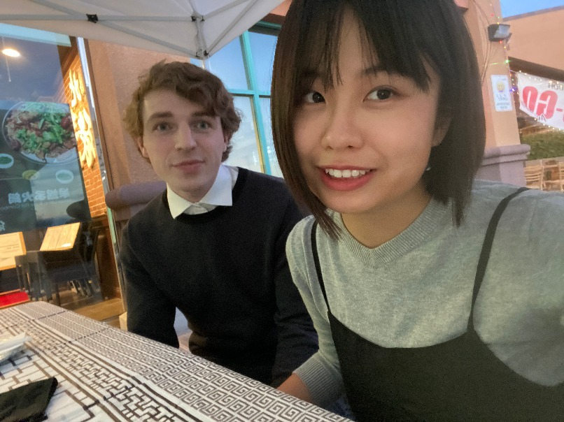

# Penpals Team Page

Team Values
-----------------
- Collaboration: We believe in strong collaboration between all members.
- Dependability: We believe in depending on one another for all of our work.
- Respectfulness: We believe in treating everyone with respect in the group.
- Learning: We believe everyone should learn in the project, and should be open to asking questions.
- Cleanliness: We believe everyone should be clean in their code and documentation.
- Having fun: We want all members to have fun with the work!

Roster
-----------------
My name is Nico Tahernia, I'm a third-year Mathematics-Computer Science major. I'm one of the team leaders and also a full-stack engineer
and architect for the project. My previous work experience involves working at [Daybreak Game Company](https://www.daybreakgames.com/home) as an Automation Engineer Intern and [Perspecta](https://perspecta.com/) as an Innovation Intern. I'm an incoming Software Development
Engineer Intern at [Amazon](https://www.amazon.com/) as well this summer in Seattle. My hobbies include a lot of sports both playing and watching (primarily soccer and tennis), music, reading, programming (lol), playing video games, and spending time with my girlfriend.

